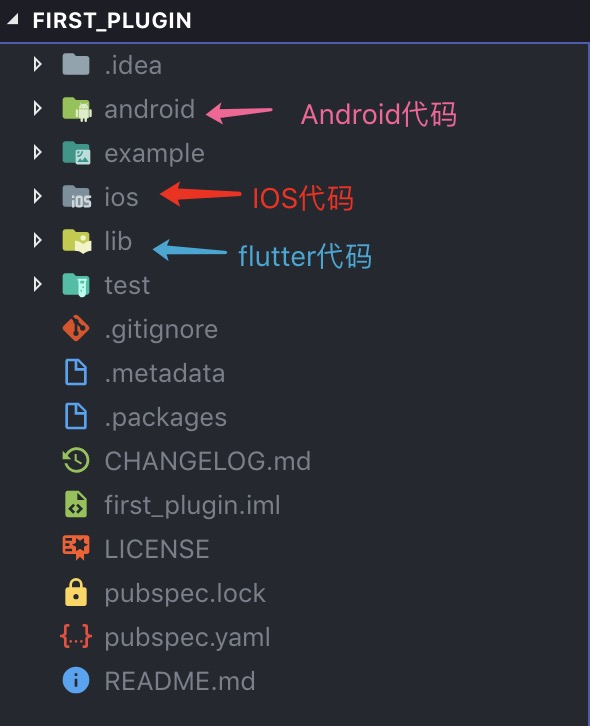
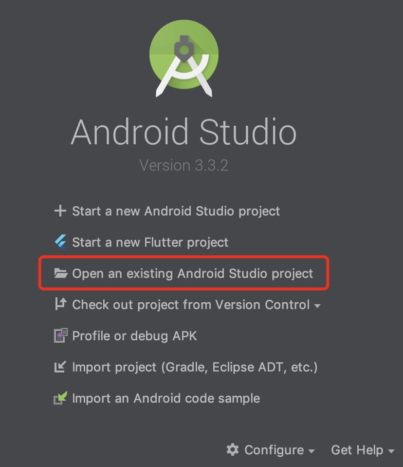
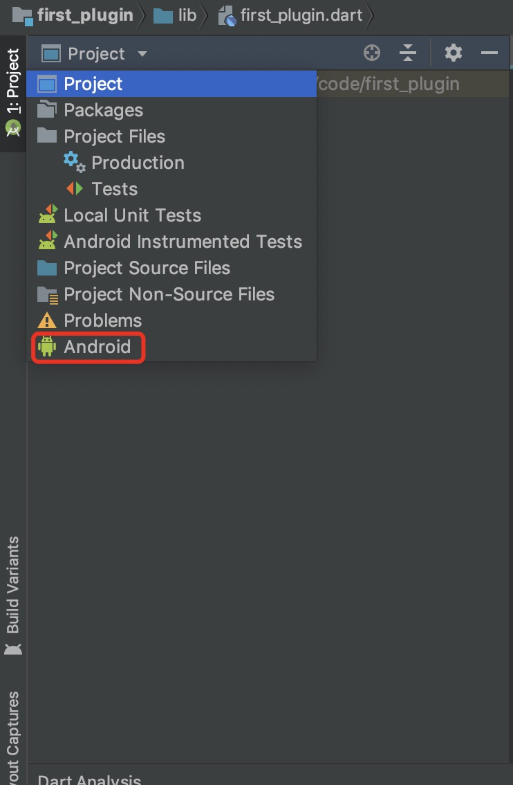
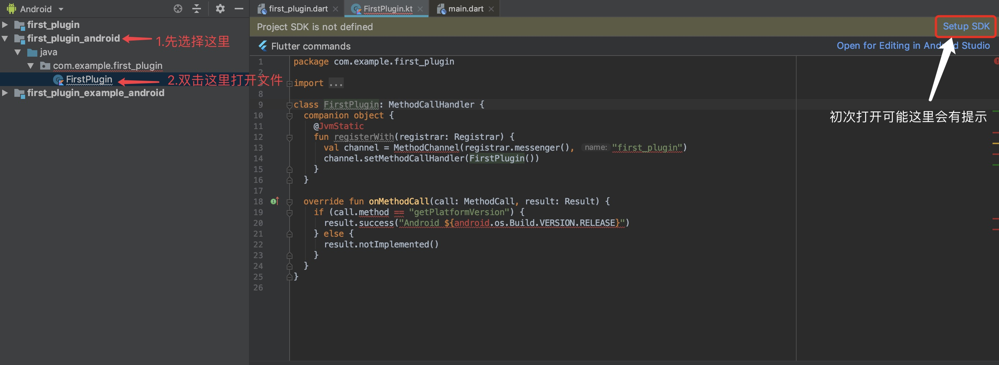
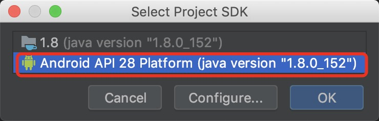
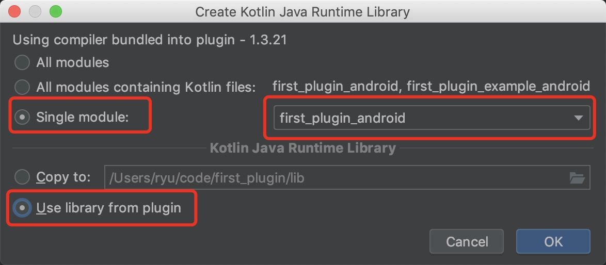
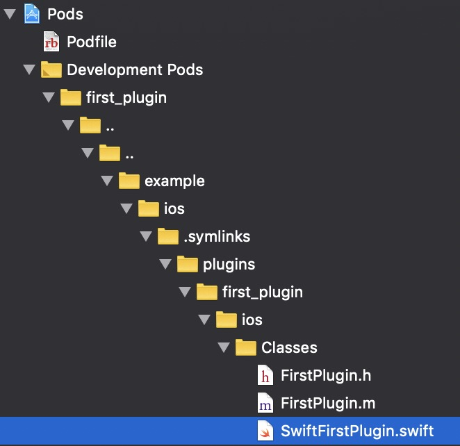
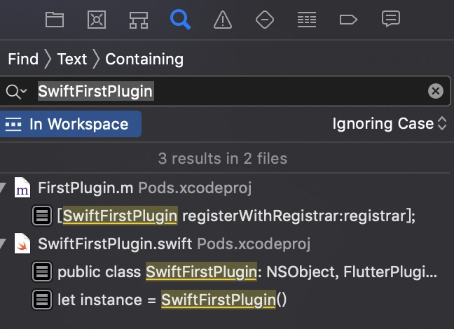
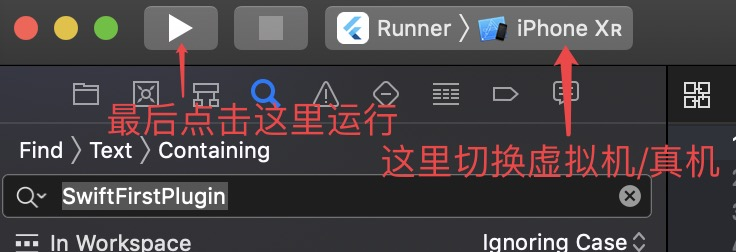

# 如何为flutter编写插件(IOS+Android)

或许在计算机前看本文章的你和我一样，是从前端转到移动端的，关于flutter的了解可能远不及移动端深厚，或者只写过ios或android的同学也可以参考。相信看完本教程之后你也可以独立进行IOS+Android的flutter插件开发。

在查看本文章之前，先确保你的环境没有问题。通过了`flutter doctor`的检查，如果你还有疑问，或者是想重新看看，可以参考官方的 [运行flutter doctor](https://flutter.dev/docs/get-started/install/macos#run-flutter-doctor)

当我们运行`flutter create -h`会获取到几个比较重要的参数。

|参数|说明|
|---|---|
|`-i`|选择IOS开发语言、Objective-C/Swift，默认Objective-C|
|`-a`|选择Android开发语言、Java/Kotlin，默认Java|
|`-t`|选择template、app/package/plugin，默认app|

选择你自己熟悉的语言，不熟悉也没关系，可以靠强大的搜索引擎来解决。

在这之前我强烈建议你先看一下语言快速入门，花费的时间也不会太多。不建议边开发边学习。

由于语言习惯，我更倾向于选择Swift + Kotlin，刚好也可以讲解着两个语言在开发过程中遇到的坑

运行`flutter create -t plugin -i swift -a kotlin first_plugin`命令，我们将会看到如下文件

<div align=center>

</div>

## Android插件编写
编写 Android 强烈建议使用`Android Studio`我们打开Android Studio。

<div align=center>


</div>

切换到Android
<div align=center>

</div>


选择Android sdk即可
<div align=center>

</div>

如果是Kotlin可能会遇到如下情况
<div align=center>

</div>
点击Configure，选择Java
<div align=center>

</div>

最后这么选 点击ok即可，这时候你的Android编写就是带语法提示的
<div align=center>

</div>

点击▶️这个按钮弹出虚拟机，就可以正式编写插件了

## IOS

编写IOS插件 基本上只能使用苹果官方的xcode，其他IDE的支持性没有那么好。

<div align=center>

</div>

我们回顾一下这张图，ios的具体代码在ios文件夹里。不过不能从这里直接打开代码文件，否则你将会失去语法提示。

先cd到example目录

这时候我们需要先在`Terminal/cmd`里先运行一遍`flutter build ios`(这将确保xcode能正确检测到ios目录下的文件)
之后执行`open ios/Runner.xcworkspace/`或者是在example目录下找到ios，然后打开`Runner.xcworkspace`这个文件

按照图片中的路劲打开文件即可
<div align=center>

</div>

还有一种快捷的方式，就是直接在搜索中，搜索你Swift文件的类名，然后点击.swift文件即可打开

<div align=center>


</div>

到这里，你就可以开始编写你的第一个flutter插件了 ，祝大家都可以编写出自己想要实现的插件 🎉🎉🎉

## Android需要注意的事项
需要注意`android/build.gradle`文件下minSdkVersion的版本设置

以及AndroidX的问题

## Swift需要注意的事项
如果是Swift需要注意`ios/${PluginClass}.podspec`文件下的swift_version设置为'4.2'
```ruby
Pod::Spec.new do |s|
  # code ..
  s.swift_version = '4.2'
end
```

然后在需要使用的项目里的ios/Podfile文件添加`use_frameworks!`
```ruby
target 'Runner' do
  use_frameworks! # <- add this
  ...
end
```

## 发布
先使用`flutter packages pub publish --dry-run`预先检查一下项目中有没有要改善的地方
之后命令`flutter packages pub publish`
点击提示的链接，登录账号。即可提交代码，需要注意的是这里需要注意的是这里需要`全局的互联网`才可以提交，`局域网`无法提交，需要注意一下。

***注意！提交后无法撤销，所以尽量整理好一个版本，写好CHANGELOG.md，pubspec.yaml，以及README.md里面给出api或者example，LICENSE等问题之后再做提交***